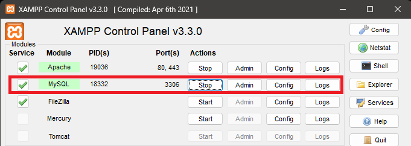
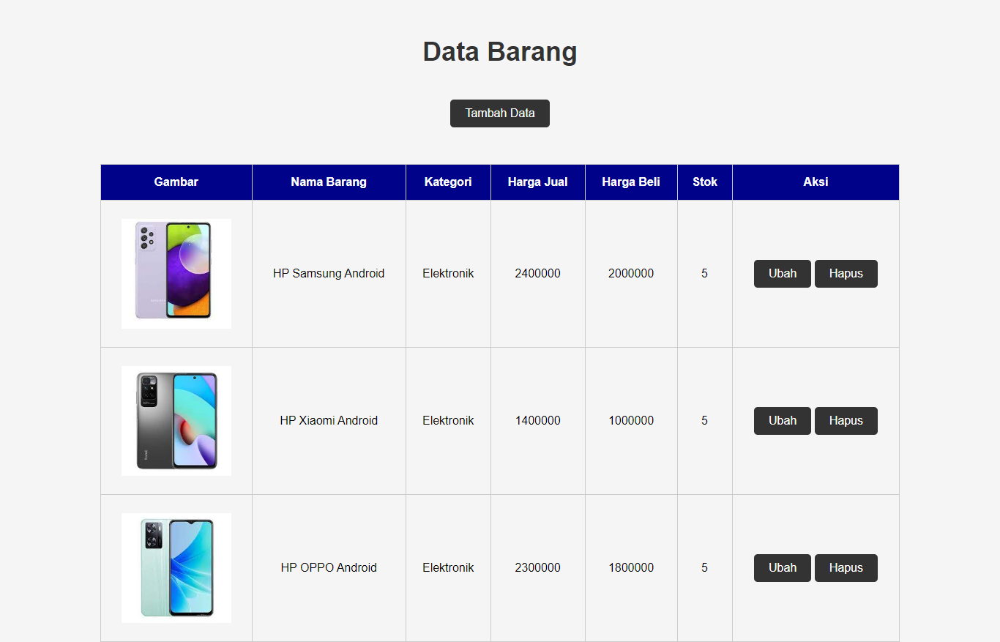

# Pratikum 3 - PHP dan Database MySQL

1. Untuk memulai aplikasi CRUD sederhana, yang perlu disiapkan adalah database server dengan menggunakan MySQL.
2. Buat folder baru dengan nama **lab3_php_database** pada docroot webserver (htdocs)


## Menjalankan MySQL Server

Untuk menjalankan MySQL Server dari menu XAMPP Control.




## Mengakses MySQL Client menggunakan PHP MyAdmin

Pastikan webserver Apache dan MySQL server sudah dijalankan. Kemudian buka melalui browser : http://localhost/phpmyadmin/


## Membuat Database : Studi Kasus Data Barang

1. Membuat Database dengan nama database **latihan1**.


2. Membuat tabel di dalam database **latihan1** dengan nama **data_barang**.


3. Menambahkan data tabel **data_barang**.


## Membuat Program CRUD

### A. Membuat File Koneksi Database

1. Buat file baru dengan nama **koneksi.php**, lalu simpan ke dalam folder **lab3_php_database**.
2. Kemudian ketikkan kode berikut :

    ```php
    <?php
    $host = "localhost";
    $user = "root";
    $pass = "";
    $db = "latihan1";

    $conn = mysqli_connect($host, $user, $pass, $db);
    if ($conn == false)
    {
    echo "Koneksi ke server gagal.";
    die();
    } else #echo "Koneksi berhasil";
    ?>
    ```

3. Buka melalui browser untuk menguji koneksi database (untuk menyampaikan pesan koneksi berhasil, **_uncomment_** pada perintah **echo "koneksi berhasil"**). Maka tampilannya akan seperti berikut ini :


### B. Membuat File Index Untuk Menampilkan Data (Read)

1. Buat file baru dengan nama **index.php**, lalu simpan ke dalam folder **lab3_php_database**.
2. Kemudian ketikkan kode berikut :

    ```php
    <?php
    include_once("koneksi.php");
    
    $sql = 'SELECT * FROM data_barang';
    $result = mysqli_query($conn, $sql);
    ?>
<!DOCTYPE html>
<html lang="en">
<head>
    <meta charset="UTF-8">
    <link href="style.css" rel="stylesheet" type="text/css" />
    <title>Data Barang</title>
</head>
<body>
    <div class="container">
        <h1>Data Barang</h1>
        <div class="main">
            <table>
            <a href="tambah.php">Tambah Data</a>
                <tr>
                    <th>Gambar</th>
                    <th>Nama Barang</th>
                    <th>Kategori</th>
                    <th>Harga Jual</th>
                    <th>Harga Beli</th>
                    <th>Stok</th>
                    <th>Aksi</th>
                </tr>
                <?php if ($result) : ?>
                    <?php while ($row = mysqli_fetch_array($result)) : ?>
                        <tr>
                            <td>" alt="<?= $row['nama']; ?>"></td>
                            <td><?= $row['nama']; ?></td>
                            <td><?= $row['kategori']; ?></td>
                            <td><?= $row['harga_jual']; ?></td>
                            <td><?= $row['harga_beli']; ?></td>
                            <td><?= $row['stok']; ?></td>
                            <td>
                                <a href="ubah.php?id=<?= $row['id_barang']; ?>">Ubah</a> 
                                <a href="hapus.php?id=<?= $row['id_barang']; ?>" onclick="return confirm('Anda yakin akan menghapus data ini?')">Hapus</a>
                            </td>
                        </tr>
                    <?php endwhile;
                else : ?>
                    <tr>
                        <td colspan="7">Belum ada data</td>
                    </tr>
                <?php endif; ?>
            </table>
        </div>
    </div>
</body>
</html>
    ```

3. Tampilannya akan seperti berikut :




### C. Menambah Data (Create)

1. Buat file baru dengan nama **tambah.php**, lalu simpan ke dalam folder **lab3_php_database**.
2. Kemudian ketikkan kode berikut :

    ```php
    <?php
    error_reporting(E_ALL);
    include_once 'koneksi.php';
    if (isset($_POST['submit'])) {
    $nama = $_POST['nama'];
    $kategori = $_POST['kategori'];
    $harga_jual = $_POST['harga_jual'];
    $harga_beli = $_POST['harga_beli'];
    $stok = $_POST['stok'];
    $file_gambar = $_FILES['file_gambar'];
    $gambar = null;
    if ($file_gambar['error'] == 0) {
        $filename = str_replace(' ', '_', $file_gambar['name']);
        $destination = dirname(__FILE__) . '/gambar/' . $filename;
        if (move_uploaded_file($file_gambar['tmp_name'], $destination)) {
            $gambar = 'gambar/' . $filename;;
        }
    }
    $sql = 'INSERT INTO data_barang (nama, kategori,harga_jual, harga_beli, stok, gambar) ';
    $sql .= "VALUE ('{$nama}', '{$kategori}','{$harga_jual}', '{$harga_beli}', '{$stok}', '{$gambar}')";
    $result = mysqli_query($conn, $sql);
    header('location: index.php');
    }
?>
<!DOCTYPE html>
<html lang="en">

<head>
    <meta charset="UTF-8">
    <link href="style.css" rel="stylesheet" type="text/css" />
    <title>Tambah Barang</title>
</head>

<body>
    <div class="container">
        <h1>Tambah Barang</h1>
        <div class="main">
            <form method="post" action="tambah.php" enctype="multipart formdata">
                <div class="input">
                    <label>Nama Barang</label>
                    <input type="text" name="nama" />
                </div>
                <div class="input">
                    <label>Kategori</label>
                    <select name="kategori">
                        <option value="Komputer">Komputer</option>
                        <option value="Elektronik">Elektronik</option>
                        <option value="Hand Phone">Hand Phone</option>
                    </select>
                </div>
                <div class="input">
                    <label>Harga Jual</label>
                    <input type="text" name="harga_jual" />
                </div>
                <div class="input">
                    <label>Harga Beli</label>
                    <input type="text" name="harga_beli" />
                </div>
                <div class="input">
                    <label>Stok</label>
                    <input type="text" name="stok" />
                </div>
                <div class="input">
                    <label>File Gambar</label>
                    <input type="file" name="file_gambar" />
                </div>
                <div class="submit">
                    <input type="submit" name="submit" value="Simpan" />
                </div>
            </form>
        </div>
    </div>
</body>
</html>
    ```

3. Tampilannya akan seperti berikut :


* Tampilan setelah data ditambahkan :


### D. Mengubah Data (Update)

1. Buat file baru dengan nama **ubah.php**, lalu simpan ke dalam folder **lab3_php_database**.
2. Kemudian ketikkan kode berikut :

    ```php
    <?php
    error_reporting(E_ALL);
    include_once 'koneksi.php';
    if (isset($_POST['submit'])) {
    $id = $_POST['id'];
    $nama = $_POST['nama'];
    $kategori = $_POST['kategori'];
    $harga_jual = $_POST['harga_jual'];
    $harga_beli = $_POST['harga_beli'];
    $stok = $_POST['stok'];
    $file_gambar = $_FILES['file_gambar'];
    $gambar = null;

    if ($file_gambar['error'] == 0) {
        $filename = str_replace(' ', '_', $file_gambar['name']);
        $destination = dirname(__FILE__) . '/gambar/' . $filename;
        if (move_uploaded_file($file_gambar['tmp_name'], $destination)) {
            $gambar = 'gambar/' . $filename;;
        }
    }
    $sql = 'UPDATE data_barang SET ';
    $sql .= "nama = '{$nama}', kategori = '{$kategori}', ";
    $sql .= "harga_jual = '{$harga_jual}', harga_beli = '{$harga_beli}', 
   stok = '{$stok}' ";
    if (!empty($gambar))
        $sql .= ", gambar = '{$gambar}' ";
    $sql .= "WHERE id_barang = '{$id}'";
    $result = mysqli_query($conn, $sql);
    header('location: index.php');
    }
    $id = $_GET['id'];
    $sql = "SELECT * FROM data_barang WHERE id_barang = '{$id}'";
    $result = mysqli_query($conn, $sql);
    if (!$result) die('Error: Data tidak tersedia');
    $data = mysqli_fetch_array($result);
    function is_select($var, $val)
    {
    if ($var == $val) return 'selected="selected"';
    return false;
    }
?>
<!DOCTYPE html>
<html lang="en">

<head>
    <meta charset="UTF-8">
    <link href="style.css" rel="stylesheet" type="text/css" />
    <title>Ubah Barang</title>
</head>

<body>
    <div class="container">
        <h1>Ubah Barang</h1>
        <div class="main">
            <form method="post" action="ubah.php" enctype="multipart/form-data">
                <div class="input">
                    <label>Nama Barang</label>
                    <input type="text" name="nama" value="<?php echo $data['nama']; ?>" />
                </div>
                <div class="input">
                    <label>Kategori</label>
                    <select name="kategori">
                        <option <?php echo is_select('Komputer', $data['kategori']); ?> value="Komputer">Komputer</option>
                        <option <?php echo is_select('Komputer', $data['kategori']); ?> value="Elektronik">Elektronik</option>
                        <option <?php echo is_select('Komputer', $data['kategori']); ?> value="Hand Phone">Hand Phone</option>
                    </select>
                </div>
                <div class="input">
                    <label>Harga Jual</label>
                    <input type="text" name="harga_jual" value="<?php echo $data['harga_jual']; ?>" />
                </div>
                <div class="input">
                    <label>Harga Beli</label>
                    <input type="text" name="harga_beli" value="<?php echo $data['harga_beli']; ?>" />
                </div>
                <div class="input">
                    <label>Stok</label>
                    <input type="text" name="stok" value="<?php echo $data['stok']; ?>" />
                </div>
                <div class="input">
                    <label>File Gambar</label>
                    <input type="file" name="file_gambar" />
                </div>
                <div class="submit">
                    <input type="hidden" name="id" value="<?php echo $data['id_barang']; ?>" />
                    <input type="submit" name="submit" value="Simpan" />
                </div>
            </form>
        </div>
    </div>
</body>
</html>
    ```

3. Tampilannya akan seperti berikut :


* Tampilan setelah data diubah :


### E. Menghapus Data (Delete)

1. Buat file baru dengan nama **ubah.php**, lalu simpan ke dalam folder **lab3_php_database**.
2. Kemudian ketikkan kode berikut :

    ```php
    <?php
    include_once 'koneksi.php';
    $id = $_GET['id'];
    $sql = "DELETE FROM data_barang WHERE id_barang = '{$id}'";
    $result = mysqli_query($conn, $sql);
    header('location: index.php');
    ?>
    ```

3. Tampilannya akan seperti berikut :


* Tampilan setelah salah satu data tersebut dihapus :


## Terimakasih!